<p align="center">
  
</p>

<p align="center">
  
  
  
  
  
</p>

---

## What this is

**MAGITO** (*Modular Agent Governance & Task Orchestration*) is a personal,
version-controlled configuration layer for agentic command-line tools. One repo holds
your shared agent persona, skills, and subagents; an install script symlinks them into
the native config paths each tool expects. Edit once, `git pull` anywhere, and every
tool on every machine stays in sync.

<details>
<summary>Why "MAGITO"?</summary>

It's named after — and lightly modeled on — the **MAGI** supercomputer system from
*Neon Genesis Evangelion*: three semi-independent cores deliberating under one
governance layer. The MAGI decided the fate of humanity. This decides which markdown
file your CLI reads. The ambition is, let's say, *scoped*.

| MAGI core      | …governs       | Role here                                  |
|----------------|----------------|--------------------------------------------|
| **MELCHIOR**   | Claude Code    | Primary orchestrator — subagents, skills, worker delegation |
| **BALTHASAR**  | Codex          | Shares the same persona via `AGENTS.md`    |
| **CASPER**     | Gemini CLI     | Shares the same persona via `GEMINI.md`    |

</details>

All three read from a **single source of truth** (`shared/SYSTEM-INSTRUCTIONS.md`), so
your standards stay identical no matter which CLI you reach for.

The governance layer goes further than shared instructions: the primary orchestrator
can delegate implementation work to *other* CLIs as headless workers — a cheap model
builds in an isolated worktree, the orchestrator reviews and lands it. Worker
commands are machine-local (`~/.magito/workers.toml`), so each machine hires from
whatever CLIs it actually has.

Learning to drive it? Start with the **[Playbook](PLAYBOOK.md)** — situation → play
→ where you stay in the loop, plus the behavior promises magito keeps while the
internals evolve.

## How it works

The model is dead simple: **files live in this repo; the tools read them via symlink.**
`install.py` (stdlib-only Python, 3.11+) reads your machine-local `install.toml` and
creates those symlinks for every tool you've enabled. Because they're symlinks:

- **Editing the content of an existing file is live instantly** — no reinstall. The tool
  reads through the link to the repo file.
- **Adding a *new* skill, agent, or hook requires a reinstall** — a new file needs a new link.

The script is idempotent (safe to re-run), and regenerates `skills/INDEX.md` from each
skill's frontmatter on every run. Exactly which repo path maps to which tool's native
config path is listed in [`CLAUDE.md`](CLAUDE.md).

## Quick start (first time on a machine)

```bash
git clone <repo-url> ~/code/magito
cd ~/code/magito

cp install.toml.example install.toml   # your local, gitignored config
$EDITOR install.toml                    # set enabled = true for tools you use

python install.py --dry-run            # preview every symlink it would create
python install.py                      # apply
```

That's it — your CLIs now read this repo.

---

## User guide

### 🔄 Syncing a change to another machine

This is the one you'll reach for most. You changed something on machine A; pull it down
on machine B:

```bash
cd ~/code/magito
git pull
python install.py        # only strictly needed if NEW skills/agents/tools were added
```

**Rule of thumb for whether you need `install.py` after a pull:**

| What changed in the pull                                  | Reinstall needed? |
|-----------------------------------------------------------|-------------------|
| Edited `SYSTEM-INSTRUCTIONS.md` or an existing `SKILL.md`  | **No** — symlink already points there, change is live |
| Added a brand-new skill, agent, hook, or tool stanza      | **Yes** — needs a new symlink |
| Not sure                                                  | Just run it — it's idempotent and harmless |

When in doubt, run `python install.py`. It never does damage on a re-run.

<details>
<summary>➕ Adding a new skill, subagent, hook, or tool</summary>

Full steps for each — which directory a skill goes in, subagent frontmatter fields, the
hook contract, wiring up a new tool stanza — live in [`CLAUDE.md`](CLAUDE.md) under
"Adding a New Skill / Agent / Hook / Tool". That's the file the agents themselves read
before extending this repo, so it stays the one source of truth for these steps.

Short version, every case: create the file with the right frontmatter, then run
`python install.py` to symlink it and regenerate `skills/INDEX.md`.

</details>

<details>
<summary>🩺 Troubleshooting</summary>

```bash
python install.py --dry-run     # show what WOULD happen, change nothing
python install.py --force       # replace symlinks that currently point elsewhere
ls -la ~/.claude/CLAUDE.md       # confirm a link resolves back into this repo
```

- **A tool isn't picking up changes?** Check the symlink actually points here:
  `ls -la <native-path>`. If it points somewhere stale, re-run with `--force`.
- **`install.py` gotcha (for hacking on the script):** never call `.resolve()` on a
  *destination* path before linking — it follows existing symlinks back to the source
  and breaks idempotency.

</details>

---

Full repo layout and the per-tool path table live in [`CLAUDE.md`](CLAUDE.md), kept in
one place so they don't drift out of sync with what the agents actually see.

---

<p align="center"><sub>
  MELCHIOR · BALTHASAR · CASPER — deliberation complete. <b>STATUS: READY.</b>
</sub></p>
