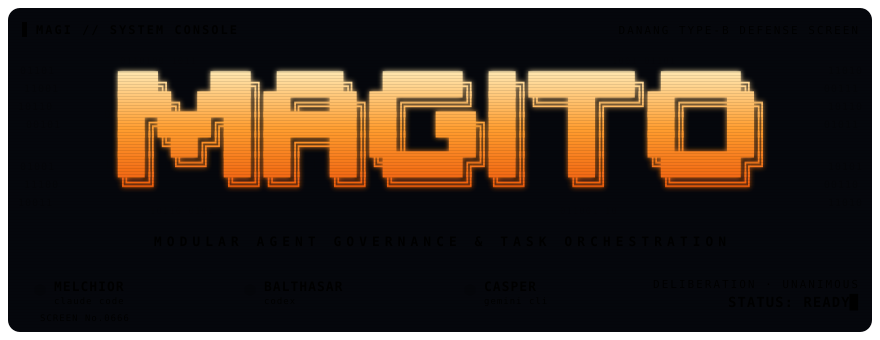

<p align="center">
  
</p>

<p align="center">
  
  
  
  
  
</p>

---

## What this is

**MAGITO** (*Modular Agent Governance & Task Orchestration*) is a personal,
version-controlled configuration layer for agentic command-line tools. One repo holds
your shared agent persona, skills, and subagents; an install script symlinks them into
the native config paths each tool expects. Edit once, `git pull` anywhere, and every
tool on every machine stays in sync.

<details>
<summary>Why "MAGITO"?</summary>

It is named after — and lightly modeled on — the **MAGI** supercomputer system from
*Neon Genesis Evangelion*: three semi-independent cores deliberating under one
governance layer. The MAGI decided the fate of humanity. This decides which markdown
file your CLI reads. The ambition here is deliberately *scoped*.

| MAGI core      | …governs       | Role here                                  |
|----------------|----------------|--------------------------------------------|
| **MELCHIOR**   | Claude Code    | Primary orchestrator — subagents, skills, worker delegation |
| **BALTHASAR**  | Codex          | Shares the same persona via `AGENTS.md`    |
| **CASPER**     | Gemini CLI     | Shares the same persona via `GEMINI.md`    |
| —              | Antigravity    | Shares Gemini CLI's persona via the same `GEMINI.md` (enable only one) |
| —              | omp (Oh My Pi) | Shares the same persona via `AGENTS.md`    |

</details>

Every tool reads from a **single source of truth** (`shared/SYSTEM-INSTRUCTIONS.md`), so
your standards stay identical no matter which CLI you reach for.

The governance layer goes further than shared instructions: the primary orchestrator
can delegate implementation work to *other* CLIs as headless workers — a cheap model
builds in an isolated worktree, the orchestrator reviews and lands it. Worker
commands are machine-local (`~/.magito/workers.toml`), so each machine hires from
whatever CLIs it actually has. It also keeps a session journal — one file per
session recording what happened and what is unfinished — so a fresh session can
pick up where the last one left off.

Learning to drive it? Read [Which skill when](#which-skill-when): the main path, one line for
every other skill, and the promises magito keeps.

## How it works

The model is dead simple: **files live in this repo; the tools read them via symlink.**
`install.py` (stdlib-only Python, 3.11+) reads your machine-local `install.toml` and
creates those symlinks for every tool you have enabled. Because they are symlinks:

- **Editing the content of an existing file is live instantly** — no reinstall. The tool
  reads through the link to the repo file.
- **Adding a *new* skill, agent, or hook requires a reinstall** — a new file needs a new link.

The script is idempotent (safe to re-run), and regenerates `skills/INDEX.md` from each
skill's frontmatter on every run. Exactly which repo path maps to which tool's native
config path is listed in [`CLAUDE.md`](CLAUDE.md).

## Quick start (first time on a machine)

```bash
git clone <repo-url> ~/code/magito
cd ~/code/magito

cp install.toml.example install.toml   # your local, gitignored config
$EDITOR install.toml                    # set enabled = true for tools you use

python install.py --dry-run            # preview every symlink it would create
python install.py                      # apply
```

That is it — your CLIs now read this repo.

## Cheat sheet

Short steps to remember. [Which skill when](#which-skill-when) explains each one.

### Set up a project (once per repo)

1. Open the repo in your agent and run **`/setup-magito`**. It checks what is already there, then asks only about what is missing. It is safe to re-run.
2. It asks one question first: **owner or guest?**
   - **Owner:** the repo is yours. magito's files are committed like any other file, and pull request titles follow Conventional Commits (`fix(scope): summary`).
   - **Guest:** the repo belongs to a team. magito never edits a file the team tracks. Everything it creates is listed in `.git/info/exclude`, so none of it shows up in `git status` or a commit. Pull requests follow the repo's own template (`.github/pull_request_template.md`) and its title style.
3. Your answer and the other settings land in `.magito/config.toml`. Change a choice by editing that file or re-running `/setup-magito`.

### The daily loop

```
/catch-up            start: what happened last time, and what is next
/intent              describe the change; answer one question at a time; say "accept"
                     → tickets, build, and review run on their own
                     → you answer only escalations
merge the pull request on GitHub
/handoff             end: one short journal entry
```

- **Already know exactly what to build?** Skip `/intent`. Run `/to-issues` with your plan, or `/implement 42` on one clear issue. Those ask you to approve the plan and say "ship it" before the pull request.
- **Several unrelated issues at once?** `/implement 12 13 14` builds each in its own worktree, in parallel, and opens one pull request each.
- **Interrupted?** Start a new session and run the same `/implement <tickets>` again. For tickets from one intent, it skips any ticket already merged into the run's integration branch and carries on.

### What stops for you

Only these: accepting an intent, answering an **escalation**, and merging. An escalation is one of six named reasons to stop:
1. the ticket is ambiguous;
2. three review rounds end without a pass;
3. a locked test or out-of-scope work must change;
4. the red check passes before any change;
5. no check command exists;
6. a merge turns the check red.

The agent quotes the evidence each time. Everything else it decides alone and lists in the pull request body for you to overrule at the merge.

### Settings that change behavior

| Setting | Where | Effect |
|---|---|---|
| `mode` | `.magito/config.toml` | `owner` or `guest`, as above |
| `check` | `.magito/config.toml` | the one command that must pass after every build step |
| `Tracker:` in an intent's header | the intent doc | use `local` or `other` instead of the repo's default tracker for that intent |
| `thrifty = true`, or `MAGITO_THRIFTY=1` | `~/.magito/workers.toml`, or your shell | builds and reviews use cheap models only |
| `reviewers = [...]` | `~/.magito/workers.toml` | which reviewer to try first; it must come from another model family |
| "via omp" (any worker name) | your request | hands the build to that worker instead of your own session |
| `magito.prTitlePattern` | `git config` | the pull request title rule; `off` for a guest repo with its own style |
| `magito.worktreeDir` | `git config` | put worktrees somewhere other than `.magito/worktrees/` |
| `magito.baseBranch` | `git config` | merge into a branch other than the default, such as `develop` |

### Where things live

| Path | What |
|---|---|
| `.magito/config.toml` | this repo's magito settings (never committed) |
| `.magito/journal/` | one file per session, read by `/catch-up` |
| `.magito/worktrees/<branch>` | each build's working copy, visible from your editor, hidden from git |
| `docs/intent/` | intent docs (in a guest repo, hidden from git) |
| `~/.magito/workers.toml` | this machine's workers and reviewers |
| `~/.magito/bench.toml` | this machine's `/magi` seats |
| `install.toml` | which tools this machine installs into (gitignored) |

## Which skill when

Skills are the source of truth. If this section disagrees with a skill, the skill is right and
this section needs a fix.

### The main path

Most work follows one path. You act at three points: accepting the intent, answering an
escalation, and the merge.

1. **`/catch-up`** starts a session. It reads the journal, the tracker, and git, then names the next move.
2. **`/intent`** interviews you one question at a time and produces an intent doc. You act here: you accept the doc.
3. **`to-issues`** runs on its own after you accept. It turns the intent into reviewed tickets and publishes them.
4. **`implement`** runs on its own after that. It builds each ticket, gets it reviewed by a model from a different family when the roster has one, and stops only for an escalation. You act here when it escalates.
5. **The pull request** is the result. You act here: you merge it. In a repo with no remote, the agent stops and asks instead, and merges only after you approve.
6. **`/handoff`** ends the session with one entry in `.magito/journal/`.

Work with no accepted intent can still enter at `/to-issues` (a plan) or `/implement` (one clear
issue). Those tickets keep the older steps: plan approval before code and "ship it" before the pull request.

### Every other skill

- **`/magi`**: a three-seat tribunal for a question no test can settle. Poll is cheap; `deliberate` asks for cost consent first.
- **`/decruft`**: a harsh structural review for the cruft that agents leave behind. It proposes cuts; you approve them.
- **`/challenging-assumptions`**: an adversarial pre-mortem of a plan before you commit, ending in a verdict.
- **`/research`**: an evidence-backed report on an open question, with options and a recommendation.
- **`/finding-lacunae`**: a hunt for the essential element that a topic or design is missing.
- **`/reviewing-changes`**: the two-axis review (Standards and Spec) of any diff, on its own.
- **`/speaking-plainly`**: reset your writing voice, or rewrite dense text plainly.
- **`/teach`**: learn a concept over several sessions, using the current directory as the workspace.
- **`/to-questionnaire`**: turn a decision you cannot make alone into a questionnaire for one person.
- **`/wait-what`**: re-pitch the last message when it did not land.
- **`/domain-modeling`**: sharpen the project vocabulary and record decisions in the glossary and ADRs.
- **`/verifying`**: the testing discipline for Python work: real seams, red-green, and data checks.
- **`/writing-for-agents`**: write skills, `AGENTS.md`, `CLAUDE.md`, issues, and prompts that agents read well.
- **`/workers`**: see which other coding tools on this machine magito can use to build and review, and why the rest are not ready. It creates the roster when the machine has none.
- **`/setup-magito`**: audit and repair one repo's magito configuration. Run it once per new project; it is safe to re-run.

### What magito promises

1. **You own every merge.** Agents branch, commit, and open pull requests. You merge a pull request yourself. In a repo with no remote, an agent merges only after your explicit approval.
2. **Nothing lands unreviewed by accident.** Work on the pipeline path gets an automatic review, from a different model family when the roster has one. Any other pull request or merge reaches a deliberate choice first: a full review, a lightweight pass, or a knowing skip.
3. **Delegation is explicit.** Reviews on the pipeline path go to a roster worker from a different model family, chosen by `worker.py reviewer`. When no such worker answers, a fresh-context subagent reviews instead, and the pull request says so. Builds delegate only to a worker you name ("via omp"). Thrifty mode limits every step to cheap models.
4. **Worker failures are loud.** A named build worker that is dead or denied stops the run instead of quietly handing the work to your subscription. Your tool's own permission prompts still apply to each worker launch.
5. **Machine-local files are yours.** `~/.magito/` is bootstrapped once with your consent and never overwritten on an agent's own initiative. `bin/` is the exception: `install.py` owns it.
6. **Staging is always explicit.** No agent bulk-stages files. A hook blocks `git add -A` everywhere.
7. **Costs are stated before they are incurred.** A fan-out declares its executor count and workers up front. Magi deliberate mode asks before it convenes.

You stay in the loop at these moments only: accepting an intent, answering an escalation, the
one-time roster bootstrap, magi deliberate cost consent, and every merge. Everything else runs
without you and stops loudly when it cannot continue.

---

## User guide

### 🔄 Syncing a change to another machine

This is the one you will reach for most. You changed something on machine A; pull it down
on machine B:

```bash
cd ~/code/magito
git pull
python install.py        # only strictly needed if NEW skills/agents/tools/bin files were added
```

**Rule of thumb for whether you need `install.py` after a pull:**

| What changed in the pull                                  | Reinstall needed? |
|-----------------------------------------------------------|-------------------|
| Edited `SYSTEM-INSTRUCTIONS.md` or an existing `SKILL.md`  | **No** — symlink already points there, change is live |
| Added a brand-new skill, agent, hook, tool stanza, or `bin/` file (e.g. `journal`) | **Yes** — needs a new symlink |
| Not sure                                                  | Just run it — it is idempotent and harmless |

When in doubt, run `python install.py`. It never does damage on a re-run.

<details>
<summary>➕ Adding a new skill, subagent, hook, or tool</summary>

Full steps for each — which directory a skill goes in, subagent frontmatter fields, the
hook contract, wiring up a new tool stanza — live in [`CLAUDE.md`](CLAUDE.md) under
"Adding a New Skill / Agent / Hook / Tool". That is the file the agents themselves read
before extending this repo, so it stays the one source of truth for these steps.

Short version, every case: create the file with the right frontmatter, then run
`python install.py` to symlink it and regenerate `skills/INDEX.md`.

</details>

<details>
<summary>🩺 Troubleshooting</summary>

```bash
python install.py --dry-run     # show what WOULD happen, change nothing
python install.py --force       # replace symlinks that currently point elsewhere
ls -la ~/.claude/CLAUDE.md       # confirm a link resolves back into this repo
```

- **A tool isn't picking up changes?** Check the symlink actually points here:
  `ls -la <native-path>`. If it points somewhere stale, re-run with `--force`.
- **`install.py` gotcha (for hacking on the script):** never call `.resolve()` on a
  *destination* path before linking — it follows existing symlinks back to the source
  and breaks idempotency.

</details>

---

Full repo layout and the per-tool path table live in [`CLAUDE.md`](CLAUDE.md), kept in
one place so they do not drift out of sync with what the agents actually see.

---

<p align="center"><sub>
  MELCHIOR · BALTHASAR · CASPER — deliberation complete. <b>STATUS: READY.</b>
</sub></p>
